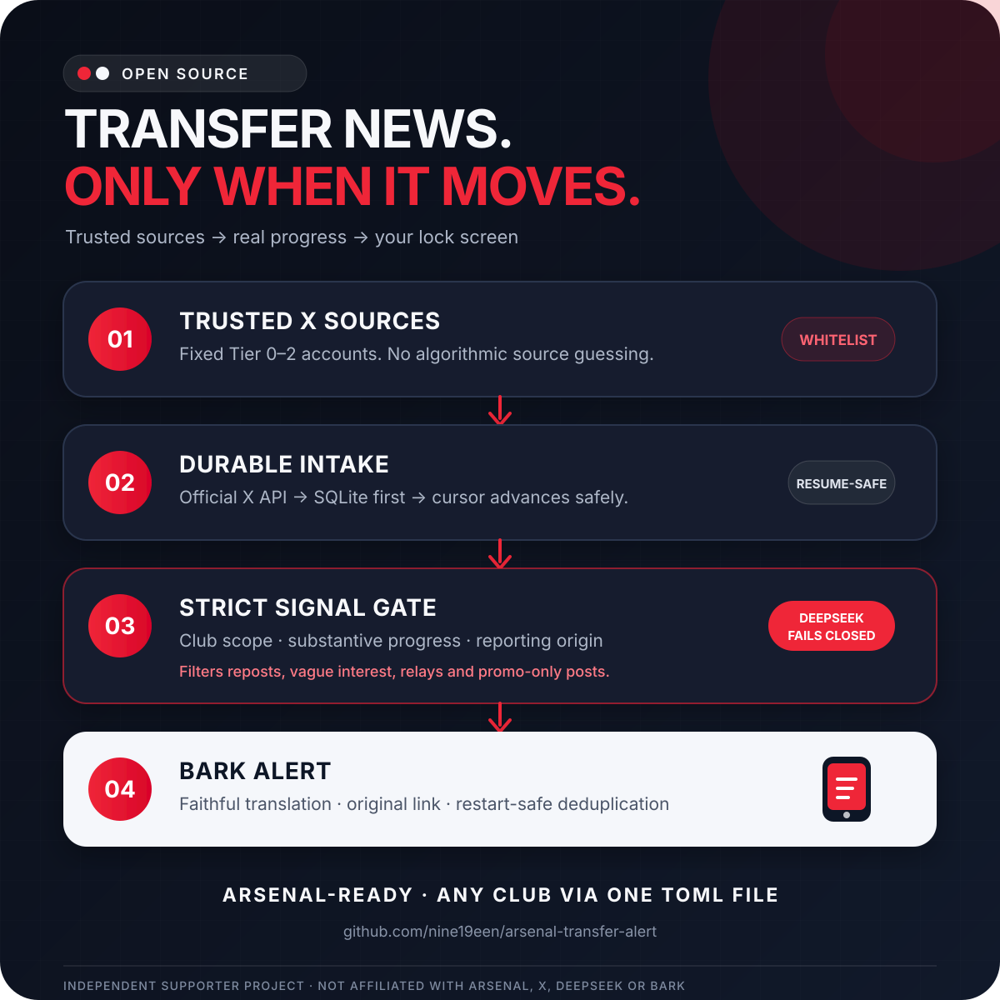

# Arsenal Transfer Alert

[简体中文](README.zh-CN.md) · [Detailed Arsenal operations guide](docs/OPERATIONS.zh-CN.md)

A low-cost, self-hosted transfer alert service built for supporters who care more about
signal than volume. It reads a fixed list of trusted X accounts, keeps only substantive
men's first-team transfer progress, translates it into your chosen language, and sends
the result to Bark.

This repository ships ready for Arsenal. The engine is club-parameterized: following a
different club means changing one TOML file, not forking the Python code.



## What it does

```text
Trusted X accounts → durable SQLite intake → strict DeepSeek filter → Bark notification
                              ↓
                  deduplication, budgets, health checks
```

- Polls only configured Tier 0–2 X accounts through the official X API.
- Rejects reposts, relays, vague interest, article promotion, ordinary team news, and
  transfer discussion that contains no concrete new development.
- Keeps first-hand reports, independent confirmations, and substantive new details.
- Preserves uncertainty: “talks” never becomes “agreement”.
- Stores posts before advancing the X cursor and deduplicates across restarts.
- Fails closed when classification is invalid or delivery outcome is uncertain.
- Tracks estimated paid-API usage and enforces local budget guards.

## Quick start — Arsenal demo

Requirements: Python 3.11+. The Python runtime has no third-party dependencies.

```powershell
git clone https://github.com/nine19een/arsenal-transfer-alert.git
cd arsenal-transfer-alert
python -m pip install -e .
Copy-Item .env.example .env
arsenal-transfer-alert doctor
arsenal-transfer-alert run --once --dry-run
```

The defaults use local fixtures, make no paid API calls, and send no real Bark message.
The checked-in [`config/sources.toml`](config/sources.toml) remains the complete Arsenal
edition: Arsenal search terms, Simplified Chinese output, Beijing time, Arsenal Bark
group/IDs, and 12 active verified sources.

## Configure another club

Start from the deliberately small template:

```powershell
Copy-Item config/sources.example.toml config/my-club.toml
```

Only three club fields are required:

```toml
[club]
key = "liverpool"
name = "Liverpool"
query_terms = ["Liverpool FC", "#LFC"]
```

Each source needs five fields:

```toml
[[sources]]
key = "trusted_reporter"
name = "Trusted Reporter"
tier = 1
username = "TrustedReporter"
query_mode = "topic" # "all" for club-specific accounts
```

Use a separate database when changing clubs, and leave the Bark group override empty so
the TOML value wins:

```dotenv
SOURCE_CONFIG_PATH=config/my-club.toml
DB_PATH=data/my-club-alert.sqlite3
BARK_GROUP=
```

Then run `arsenal-transfer-alert doctor`. Presentation fields such as output language,
timezone, labels, notification prefix, group, and ID prefix are optional and documented
inline in [`config/sources.example.toml`](config/sources.example.toml).

Before live polling, every enabled account must also have a verified numeric X user ID,
verification date, and manual identity review. This is intentionally not inferred by the
model: source reliability and account ownership are security decisions.

## Going live

Live operation requires your own X API, DeepSeek, and Bark credentials. Copy
`.env.example`, verify current API pricing, configure strict budgets, and review the
source identities before enabling any paid or delivery switch.

The relevant safety gates are explicit:

```dotenv
APP_MODE=live
PAID_API_CALLS_ENABLED=true
DRY_RUN=true
BARK_SEND_ENABLED=false
```

Use `verify-sources --allow-paid-call` to resolve X numeric IDs, review the report
yourself, then add the approved values to the TOML file. Run a real-data dry run before
setting both `DRY_RUN=false` and `BARK_SEND_ENABLED=true`.

There is no one-click deploy button. That is a deliberate scope choice: the project is
easy to configure, while paid credentials, source credibility, budgets, persistent
SQLite storage, and delivery behavior remain visible to the operator.

## Verification

```powershell
$env:PYTHONPATH = "src"
python -m unittest discover -s tests -v
python -m compileall -q src tests
```

The suite covers the Arsenal default snapshot, a second-club configuration, legacy v1
compatibility, query-injection rejection, transfer-scope/origin gates, deduplication,
recovery, Bark uncertainty, cost guards, and secret scanning.

## Documentation

- [中文快速说明](README.zh-CN.md)
- [Arsenal 默认版详细运维手册](docs/OPERATIONS.zh-CN.md)
- [API research](docs/API_RESEARCH.md)
- [Test and integration evidence](docs/TEST_RESULTS.md)
- [MIT License](LICENSE)

This is an independent supporter project and is not affiliated with Arsenal, X,
DeepSeek, or Bark.
